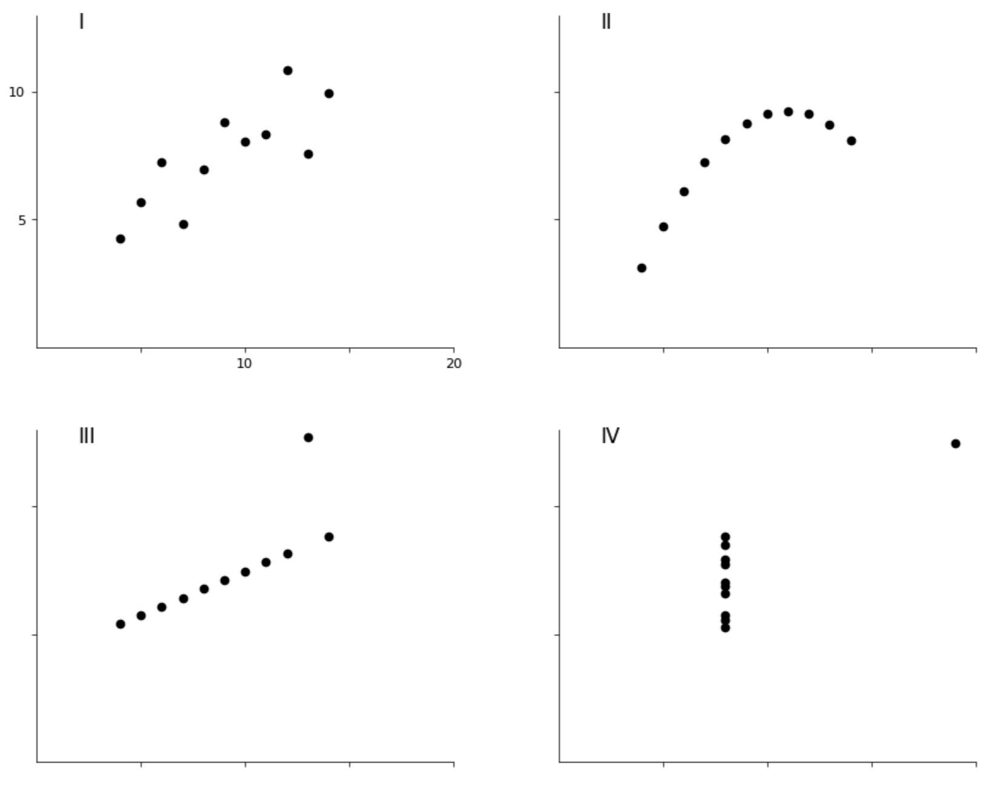

# Anscombe's Quartet

Anscombe's Quartet via `Jupyter notebooks` and `matplotlib`, and drawn in the style of Edward Tufte ([The Visual Display of Quantitative Information](https://www.edwardtufte.com/book/the-visual-display-of-quantitative-information/)). #graphicalexcellence

## What is?
[Anscombe's Quartet](https://en.wikipedia.org/wiki/Anscombe%27s_quartet) is a classic statistics demonstration that shows the value of plotting data, even when statistical properties appear similar.

All four datasets in the quartet have the following properties:

- N = 11
- mean of X's = 9.0
- mean of Y's = 7.5
- equation of regression line: Y = 3 + 0.5X
- standard error of estimate of slope = 0.118
- t = 4.24
- sum of squares X – X̄ = 110.0
- regression sum of swuares = 27.50
- residual sum of quares of Y = 13.75
- correlation coefficient = .82
- r² = .67

## Final treatment

## But why?
I am interested in the comparitive ability of various statistics and data visualization frameworks to load data and visualize (and customize!) graphs. I am starting with Jupyter notebooks, and plan to continue to other approaches, such as D3 and more out-of-the-box SaaS products such as Tableau.

I started with this simple dataset because the last time I tried something like this, it was _deceptively difficult_ to achieve the level of typographic display customization I was after. Today, in 2025 and with the help of Claude to ask questions about the customization options available, I was able to do a lot more with only Jupyter notebooks than I thought I'd be able to! Delightful.

## Requirements
- Python 3.7+
- pandas
- matplotlib
- seaborn

## Usage
Open the `anscombe.ipynb` file in Jupyter Notebook, or view the [full notebook here](./anscombe.ipynb), live in GitHub.